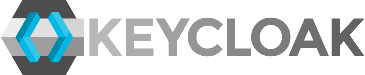
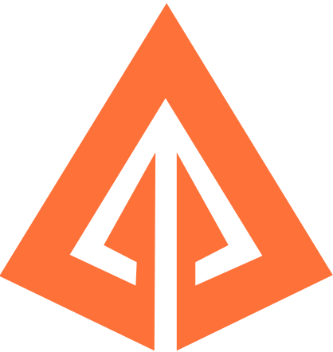

# Isekai

[Isekai](https://isekai.pl) is a platform that allows you to track and rate the anime you're watching, as well as provides a subtitle database for them.

## Tech Stack
-  Spring Framework
-  Next.js
-  Keycloak
-  Nginx
-  RabbitMQ
-  Docker
-  Kubernetes/K3s
-  Rook Ceph
-  Vault
-  Zipkin
-  Redis
-  PostgreSQL
-  MongoDB
-  Github
-  Figma
-  Java
-  TypeScript

## Cluster Architecture Diagram

The diagram above illustrates the connection between VPS servers within a Kubernetes network. The 'Cloud' server acts as the master node, responsible for managing communication between all servers and allocating resources within the cluster. The 'Storage' servers are dedicated to running the Rook Ceph service, while the 'Worker' servers run all other services

### Why VPS?
VPS was chosen for this project to gain hands-on experience with low-level infrastructure management, similar to services like AWS, Azure, or Google Cloud. Additionally, using VPS helped minimize costs compared to cloud solutions.

## Service Architecture Diagram

### Private Network
Users can access the private network only through the 'Cloud' server, which is configured with a reverse proxy using Nginx. The reverse proxy redirects traffic from subdomains to the appropriate IP addresses assigned by the K3s server. K3s is a lightweight Kubernetes distribution that simplifies the creation of nodes across multiple machines.

### Cluster
All traffic in the cluster is managed by Kubernetes' default load balancer. Pod creation begins by pulling a Docker image from a private Docker registry ([Docker Hub](https://hub.docker.com/)). Each service creates three pods to ensure that the portal remains accessible to users even if one pod becomes unavailable.

### Secret Management
Once the pods are created, they need to access sensitive information like API keys, passwords, or other credentials. These are provided to the pods by the Vault service, which securely stores and manages secrets. Vault ensures that only authorized applications can access these secrets, and it does so dynamically by injecting them into the pods at runtime.
By using Vault, the system ensures that secrets are not hardcoded into the application or container images, providing better security and flexibility for managing sensitive information.

### Storage
Two types of storage are used within the Kubernetes cluster to support the various service needs: Block Storage and Object Storage.

#### Block Storage (RBD)
is primarily used for databases like PostgreSQL and MongoDB. It is optimized for low-latency, high-performance data access, supporting frequent data writes and updates.

#### Object Storage (RGW)
handles unstructured data such as media files, documents, logs, backups, and other files required by the platform. It is designed for large volumes of data that don’t require frequent modifications but need to be stored in a scalable, secure, and durable manner. RGW (Rados Gateway) provides object storage using the S3 API, and it is used by the Storage Service to manage all files within the Isekai platform.

### Caching
is a critical component for enhancing performance and responsiveness. Redis is used to cache frequently accessed data in memory, reducing the need for repeated database queries. The system ensures that services always retrieve the most recent data by deleting outdated cache objects whenever changes are detected.

### Asynchronous Messages
allows services to communicate without blocking operations. RabbitMQ is employed for message brokering, enabling services to communicate in a decoupled, non-blocking manner. It is specifically used to manage notifications from various services to the Notification Service.

### WebSocket
enable real-time, full-duplex communication between the server and clients. This is crucial for live updates, notifications, and interactive features within the portal. To manage WebSocket connections across multiple services efficiently, RabbitMQ serves as a message broker, allowing services that require WebSocket communication to send messages to connected clients using the STOMP protocol.

### Distributed Tracing
is a technique used to track the flow of requests across multiple services in a microservices architecture. This helps identify performance bottlenecks, errors, or inefficiencies. Zipkin is used to trace and analyze requests in real-time, enabling rapid diagnosis and resolution of issues, thereby improving the reliability and responsiveness of the platform.

### Authorization & Authentication
Keycloak handles all aspects of user authentication and authorization. It ensures that users are properly verified and granted access to the appropriate resources. Keycloak features include:

#### User Authentication:
- Supports various authentication methods, including username/password, social logins (e.g., Google, Facebook), and two-factor authentication (2FA).
- Integrates with external identity providers, such as OAuth2 providers.

#### Single Sign-On (SSO):
- Allows users to log in once and access multiple services without needing to log in again for each service.

#### Role-Based Access Control (RBAC):
- Provides fine-grained access control by assigning roles to users and defining specific permissions for each role.

#### OAuth2 and OpenID Connect:
- Implements OAuth2 and OpenID Connect for secure, token-based authentication, enabling seamless integration with other services.

#### Centralized Management:
- Administrators can manage users, roles, and permissions through the Keycloak Admin Console.

#### Session Management:
- Tools for managing active user sessions, including the ability to terminate sessions or set timeouts for enhanced security.

### Server Side Rendering
Server-Side Rendering (SSR) improves SEO, performance, and user experience by rendering pages on the server instead of the client. This approach allows the portal to deliver fully-formed HTML pages to users instantly, enhancing SEO and reducing load times.